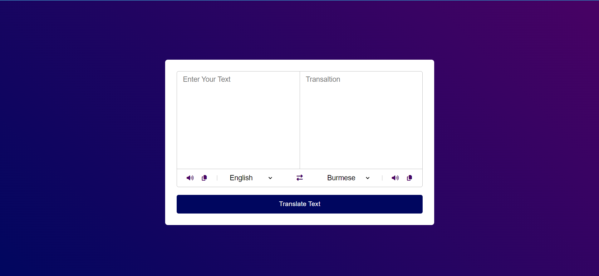

# Translator App

This is a simple translator app that allows users to translate text from one language to another. The interface is clean and user-friendly, providing an easy way for users to input text, select languages, and view the translated text.

## Features

- **Text Input**: Users can input the text they want to translate.
- **Language Selection**: Users can select the source and target languages from dropdown menus.
- **Translation Output**: Displays the translated text in the target language.
- **Swap Languages**: A button to swap the source and target languages.
- **Text-to-Speech**: Buttons to listen to the input and translated text.
- **Copy to Clipboard**: Option to copy the translated text to the clipboard.

## Technologies Used

- **HTML/CSS**: For the structure and styling of the application.
- **JavaScript**: For handling user interactions and making API calls.
- **Translation API**: Integration with a translation API to fetch translated text.

## Usage

- **Enter Your Text**: Type or paste the text you want to translate into the left text area.
- **Select Languages**: Use the dropdown menus to select the source and target languages.
- **Translate Text**: Click the "Translate Text" button to get the translation.
- **Swap Languages**: Click the swap icon to exchange the source and target languages.
- **Text-to-Speech**: Use the speaker icons to listen to the input and translated text.
- **Copy to Clipboard**: Click the copy icon to copy the translated text.

## Screenshot

